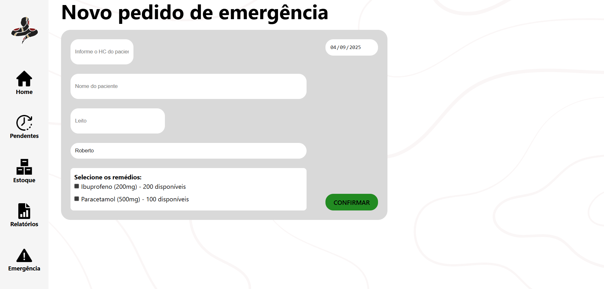
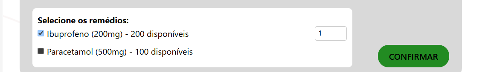

## Funcionalidade da tela Emergência

&emsp;A tela de emergência permite que o operador registre manualmente no banco de dados a retirada de um medicamento do estoque em situações em que o processo não passou pelo robô.

&emsp;Nessa tela, é possível informar o HC do paciente, seu nome, a data, o leito e selecionar o medicamento retirado. O registro de aprovação é automaticamente atribuído ao usuário que está realizando o pedido de emergência.

Fonte: Material produzido pelos autores (2025).

&emsp;Na area de seleção de remedios, quando selecionado, o operador consegue escolher a quantidade de remedios removidos do estoque a base da quantidade disponivel.

Fonte: Material produzido pelos autores (2025).

