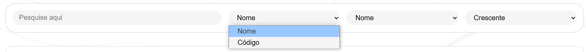

## Funcionalidade da tela de Estoque

&emsp;A função desta tela é listar os medicamentos em estoque de forma avançada, por meio de um sistema de pesquisa que permite ao operador consultar diretamente o banco de dados.

Fonte: Material produzido pelos autores (2025).

&emsp;Cada medicamento é exibido em uma caixa que apresenta seu nome, dose, validade, quantidade disponível e código de identificação.

Fonte: Material produzido pelos autores (2025).

&emsp;A tela conta com uma área de pesquisa, na qual há um campo de texto para digitação e uma aba dropdown ao lado. Essa aba permite escolher se a busca será feita pelo nome do medicamento ou pelo seu código de registro.

Fonte: Material produzido pelos autores (2025).

&emsp;Ao lado da área de pesquisa, há uma aba dropdown de filtragem. Com ela, o operador pode definir se os resultados devem ser ordenados por nome (ordem alfabética), código (ordem numérica), dose, validade ou quantidade de unidades.

Fonte: Material produzido pelos autores (2025).

&emsp;Por fim, existe uma aba dropdown de ordenação, que define se os resultados serão exibidos em ordem crescente ou decrescente, com base no critério de filtragem selecionado anteriormente.

Fonte: Material produzido pelos autores (2025).

