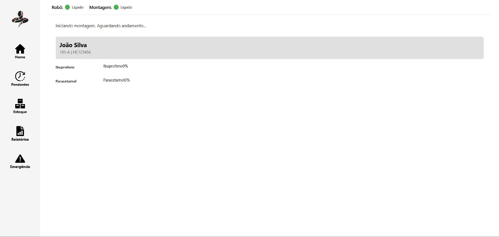
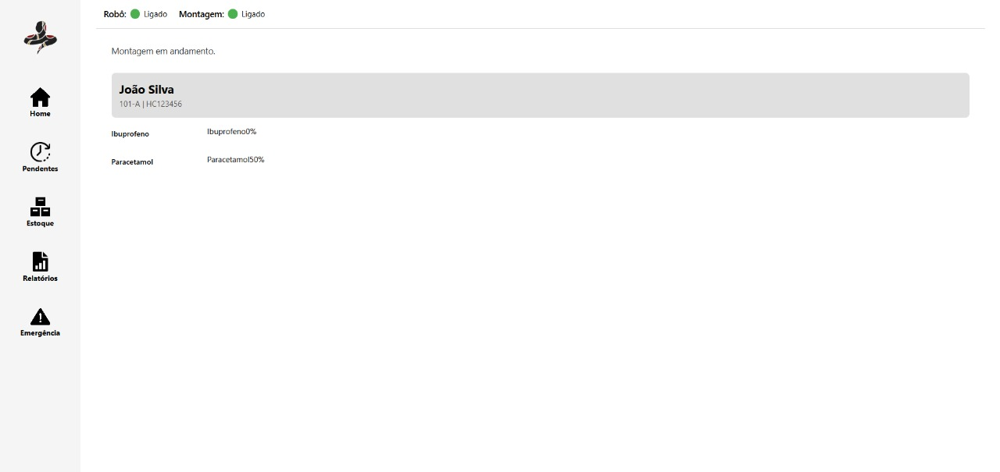
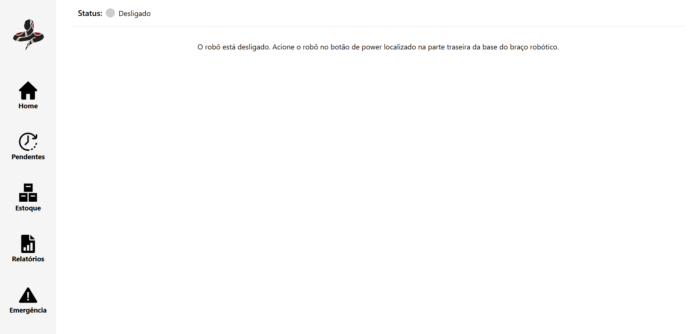

## Funcionalidade

&emsp;A tela Home tem como função servir de central de acesso para as demais telas do sistema. Logo após o login, o operador é redirecionado automaticamente para essa tela. No canto esquerdo, há uma aba de navegação fixa que permite alternar facilmente entre as diferentes telas, permanecendo visível independentemente da tela acessada.

&emsp;A própria tela Home realiza uma conexão em tempo real com o status do robô e das montagens em andamento. No topo da tela, ícones informativos indicam o estado atual do sistema. Na área de montagem, é possível visualizar o nome do paciente e os medicamentos associados à montagem ativa, juntamente com as porcentagens de conclusão da separação desses medicamentos realizada pelo robô.

Fonte: Material produzido pelos autores (2025).

&emsp;Com a montagem em andamento, a porcentagem é atualizada em tempo real, permitindo acompanhar o nível de conclusão do processo.

Fonte: Material produzido pelos autores (2025).

&emsp;Caso o robô esteja desligado, a tela exibirá essa informação e instruções sobre como iniciá-lo serão apresentadas ao operador.

Fonte: Material produzido pelos autores (2025).

## Integração

&emsp;A integração da tela da Home é realizada por meio de comunicação em tempo real utilizando WebSockets. Implementamos um hook personalizado que se conecta ao backend Flask, possibilitando o recebimento contínuo de dados sobre o status do robô, montagem em andamento e progresso de separação de medicamentos.

&emsp;Ao estabelecer a conexão, recebemos informações do paciente, a lista de medicamentos sendo montados e o progresso de cada item, que é exibido dinamicamente com barras de progresso.

&emsp;O status do robô e da montagem também são atualizados em tempo real e indicados visualmente por meio de ícones e mensagens. Caso o robô esteja desligado, exibimos orientações para o operador iniciá-lo corretamente.

&emsp;Toda a lógica de renderização da interface é baseada nas mensagens recebidas via WebSocket, o que garante atualizações instantâneas sem a necessidade de recarregar a página ou realizar novas requisições HTTP.
