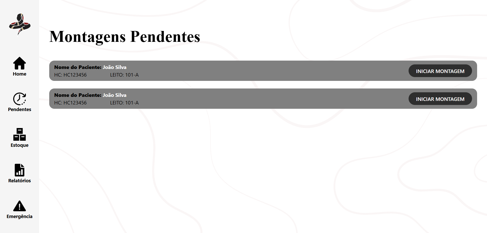
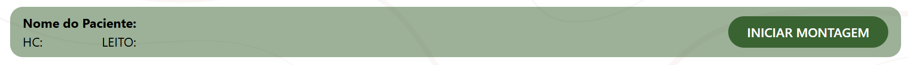
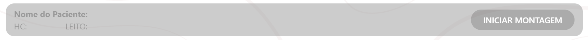

## Funcionalidade

&emsp;A tela de Montagens Pendentes tem como função exibir os pedidos de montagem que aguardam execução. A partir dela, o operador pode iniciar uma montagem, acionando o processo do robô.

Fonte: Material produzido pelos autores (2025).

&emsp;Ao selecionar uma montagem para iniciar, ela será destacada em verde, indicando que está em andamento.

Fonte: Material produzido pelos autores (2025).

&emsp;As demais montagens serão exibidas em cinza e ficarão desativadas até que a montagem em andamento seja concluída.

Fonte: Material produzido pelos autores (2025).

