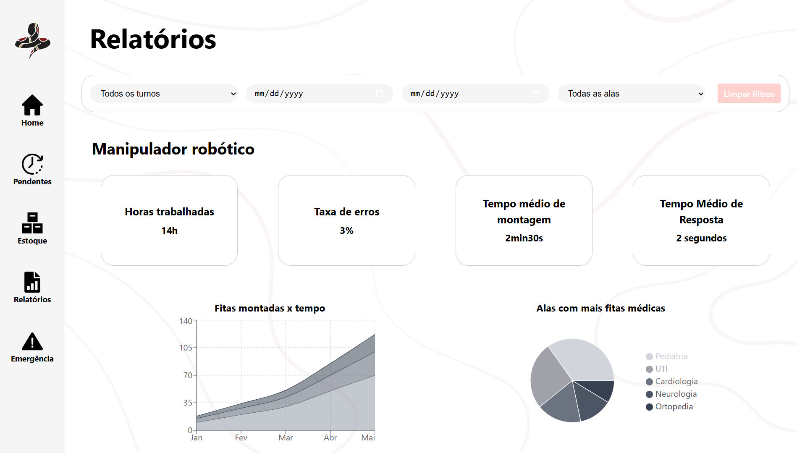
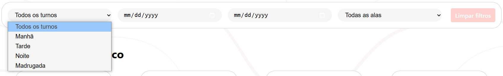
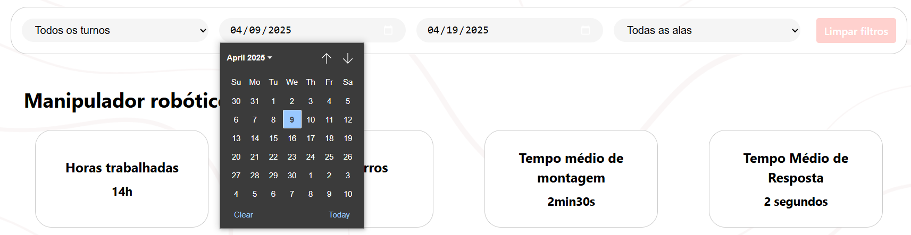
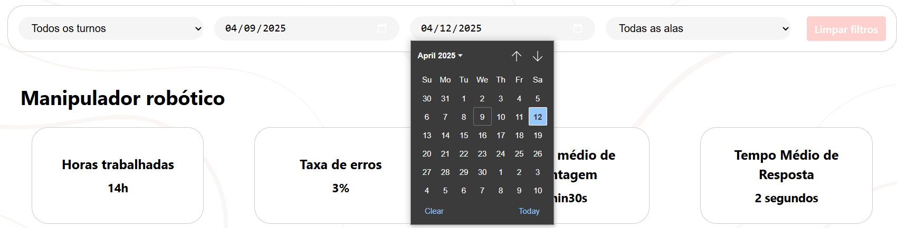
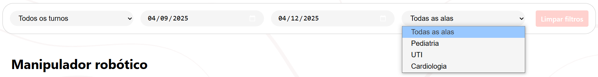
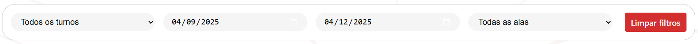

## Funcionalidade da tela Relatorio

&emsp;A tela de Relatório permite ao operador visualizar graficamente os dados de logs do robô, incluindo informações sobre horas trabalhadas, taxa de erro, tempo médio de montagem e tempo médio de resposta. Além disso, estão disponíveis gráficos relacionados ao uso das fitas ao longo do tempo e à quantidade de fitas movimentadas entre as alas do hospital.

Fonte: Material produzido pelos autores (2025).

&emsp;Essas informações podem ser filtradas conforme a necessidade. Na área superior da tela, é possível selecionar os diferentes turnos para refinar os dados exibidos.

Fonte: Material produzido pelos autores (2025).

&emsp;Também é possível restringir a visualização para um intervalo específico entre duas datas.

Fonte: Material produzido pelos autores (2025).

Fonte: Material produzido pelos autores (2025).

 

&emsp;O último filtro disponível permite especificar a ala do hospital que se deseja analisar.

Fonte: Material produzido pelos autores (2025).

&emsp;Para remover todos os filtros aplicados, basta utilizar o botão localizado ao final da caixa de filtros.

Fonte: Material produzido pelos autores (2025).

