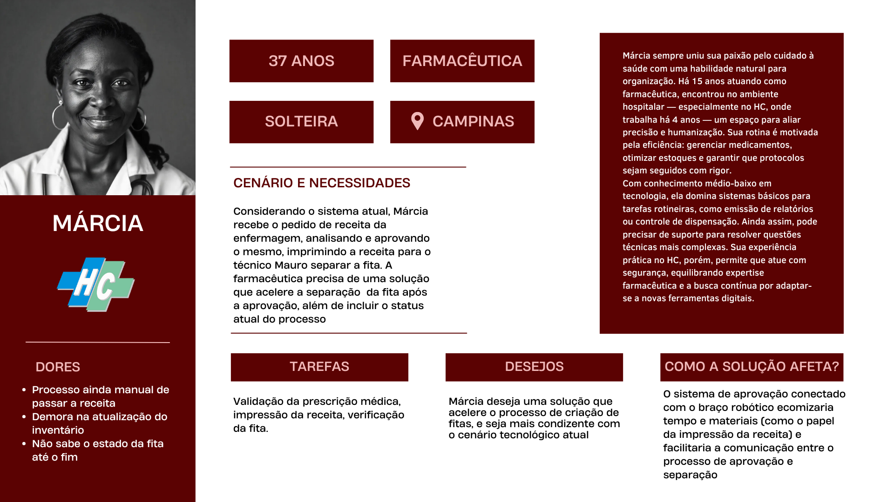

# Personas 

&emsp; A criação de personas é uma ferramenta essencial para compreender os usuários do sistema, permitindo o desenvolvimento de soluções mais alinhadas às suas necessidades. Por meio de pesquisas de campo, foram identificadas duas principais funções atuantes no processo de montagem da fita médica: o farmacêutico e o técnico de farmácia. Esses profissionais desempenham papéis fundamentais na validação, separação e registro de medicamentos, garantindo precisão e segurança na administração dos tratamentos.

&emsp; O farmacêutico é responsável pela conferência da prescrição médica, assegurando que os medicamentos estejam corretos e dentro das normas estabelecidas. Além disso, supervisiona o processo e auxilia na organização do estoque, garantindo a disponibilidade dos insumos conforme a demanda hospitalar. Já o técnico de farmácia realiza a montagem da fita médica, separando os medicamentos conforme a prescrição e registrando cada item no sistema.

&emsp; Com base nesses papéis, foram desenvolvidas duas personas: Mauro, o técnico em enfermagem, que lida diretamente com a separação e bipagem dos medicamentos, e Marcos, o farmacêutico, que supervisiona o processo e garante a conformidade das prescrições. Essas personas representam os principais desafios e necessidades desses profissionais, permitindo que a solução proposta atenda de forma eficiente às suas demandas no ambiente hospitalar.

## Mauro

&emsp; Mauro é um profissional dedicado, com 15 anos de experiência na área da saúde, sendo os últimos 10 anos no Hospital das Clínicas da Unicamp. Seu trabalho é essencial para garantir a correta separação e distribuição dos medicamentos aos pacientes. Ele valoriza o dinamismo do ambiente hospitalar, a interação com equipes médicas e a oportunidade de aprendizado contínuo, pois acredita que cada plantão é uma nova chance de oferecer cuidado, esperança e humanidade.

&emsp; Atualmente, Mauro lê a prescrição validada pelo farmacêutico, seleciona os medicamentos, escaneia seus códigos de barra e registra no sistema o medicamento, paciente, horário, dose e via. Esse fluxo manual pode levar a atrasos e comprometer a eficiência do atendimento, isto é,demorado e repetitivo, o que aumenta a chance de erro. 

&emsp; Ele deseja uma solução que otimize seu trabalho, reduzindo erros e tornando o processo mais rápido e eficiente. Seu nível intermediário de proficiência tecnológica permite que ele lide bem com sistemas hospitalares, mas soluções automatizadas poderiam melhorar ainda mais seu desempenho.

&emsp; Portanto, a implementação de um braço robótico para a seleção e bipagem automática dos medicamentos traria benefícios diretos, reduzindo erros e aumentando a velocidade do processo. Além disso, a solução melhoraria a gestão do estoque, garantindo mais precisão no controle dos insumos hospitalares. Isso permitiria que Mauro e sua equipe focassem em atividades mais estratégicas e no cuidado direto aos pacientes.

## Márcia

&emsp;Márcia, com mais de 15 anos dedicados à profissão de farmacêutica, sempre desempenhou um papel importante em diversos ambientes hospitalares. Recentemente, ela foi contratada pelo Hospital de Clínicas da Unicamp para ocupar um cargo similar.

&emsp;Na atual posição, suas extensas responsabilidades garantem funcionamento da farmáia e enfermaria do hospital. Entre outras tarefas, Márcia é responsável pela verificação e aprovação de receitas médicas, garantindo a segurança e apropriabilidade dos tratamentos prescritos. Ela também realiza a manipulação de medicamentos, muitas vezes envolvendo a preparação de fármacos específicos conforme orientações médica e farmacêutica.

&emsp;Apesar de todo esse tempo na posição, Márcia percebe que algumas coisas poderiam ser atualizada. Mesmo com seu pouco costume de utilizar novas tecnologias, ela percebe que o sistema atual de aprovação de receitas, a necessidade de imprimir a receita no papel para um técnico separar os remédios e os vários passos de verificação atrasam a entrega de remédios para os pacientes.

&emsp;Pensando nessas necessidades, a implementação do sistema integrado com o braço robótico da nossa solução otimizaria o trabalho de Márcia na fármacia do hospital, reduzindo os gastos de tempo desnecessários como a impressão física da receita, diversas etapas de verificação, atualização do estoque no sistema, entre vários outros benefícios.