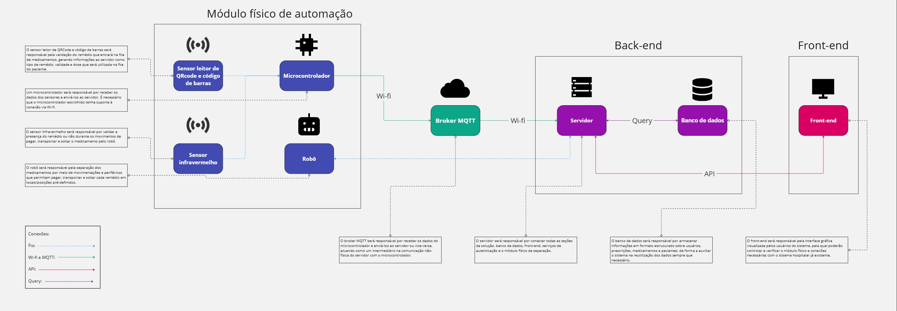
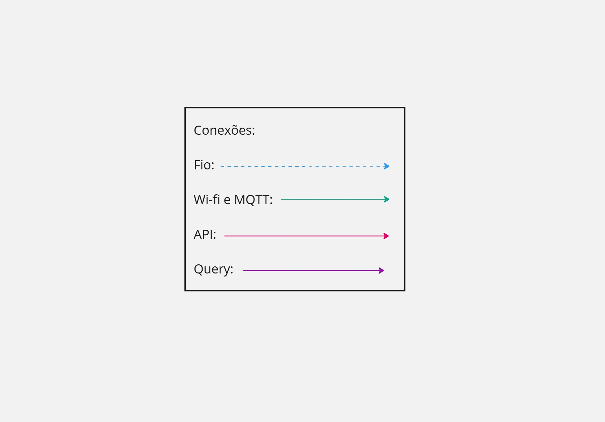
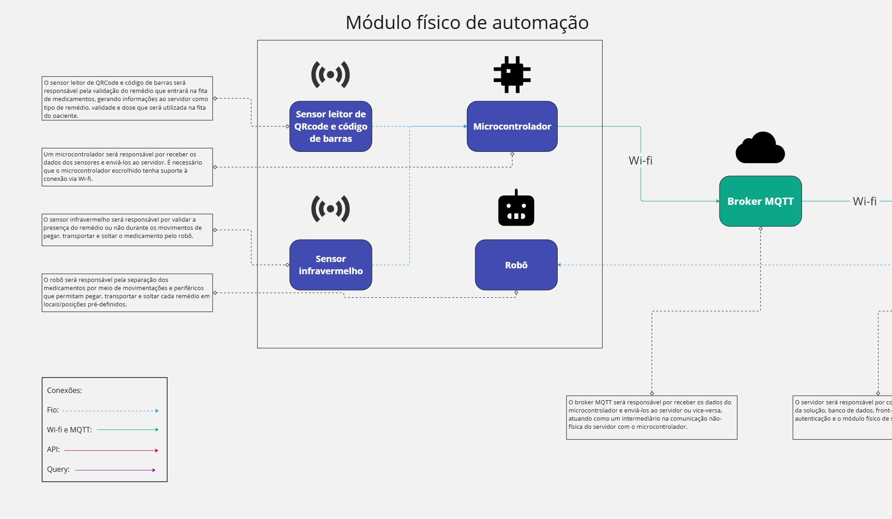
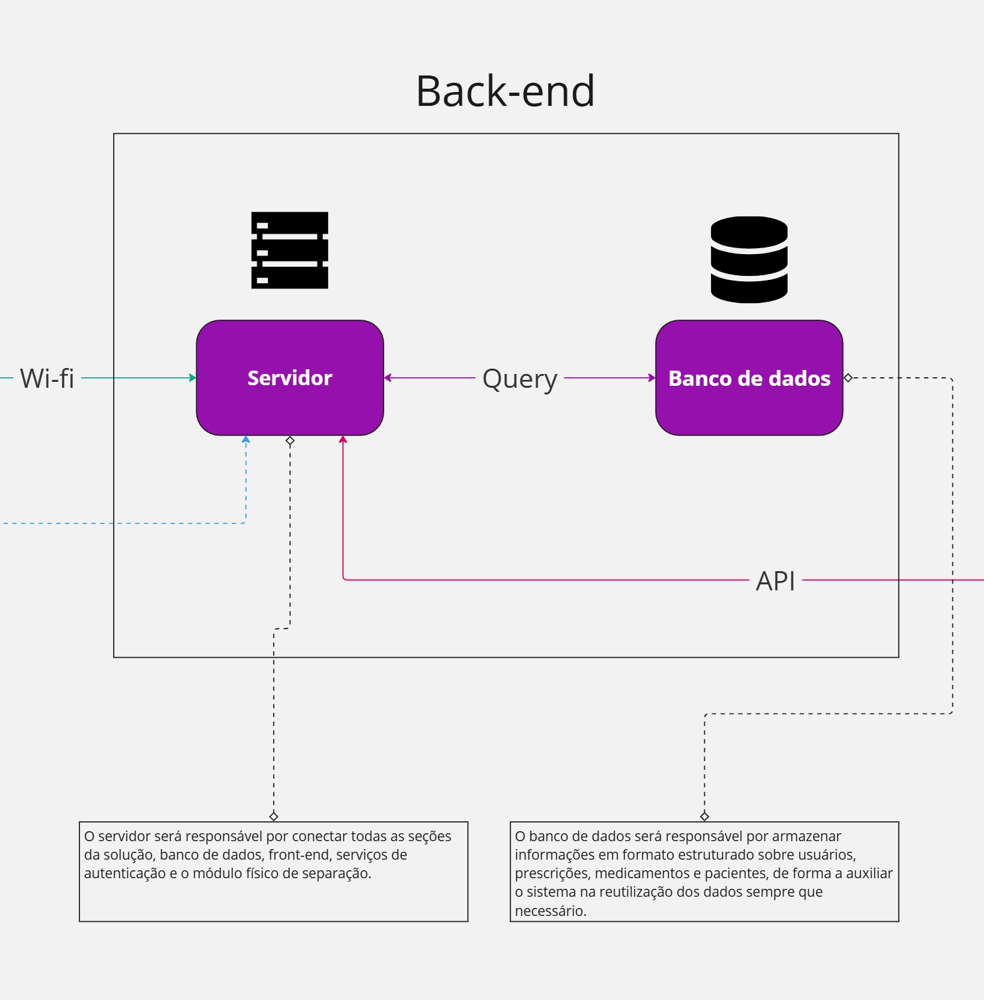
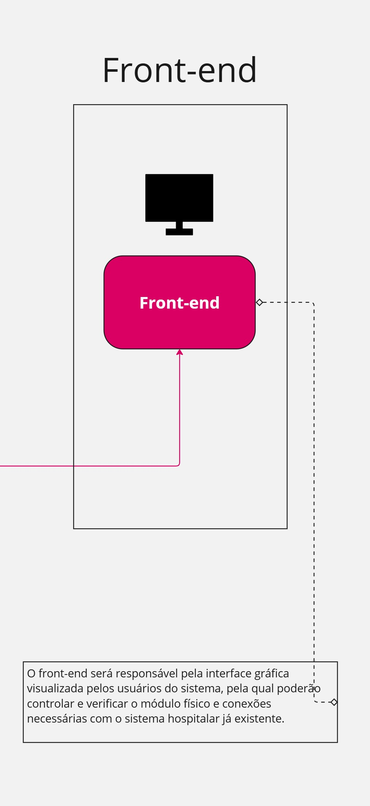

# Proposta de arquitetura do sistema

&emsp;Segundo a norma ISO/IEC/IEEE 42010, publicada em 2011 e atualizada em 2022, "a arquitetura de software são os conceitos fundamentais de um sistema, incluindo seus elementos, relacionamentos e os princípios para seu projeto e evolução". Essa definição exprime os principais aspectos da arquitetura de um software, ou seja, o projeto que contém os elementos e suas relações dentro do sistema. Dessa forma, a arquitetura embarca os princípios que regem a forma como todos os elementos do software se conectam, de forma detalhada e clara, pois é o esqueleto do sistema inteiro. Além disso, a arquitetura de um sistema abarca informações como os tipos de conexões e trocas de dados entre os componentes.

&emsp;Nesse primeiro momento, a equipe Hígia preocupou-se não em determinar aspectos e escolhas de tecnologias e/ou ferramentas, mas em desenvolver uma proposta de arquitetura agnóstica à tecnologia. Isso significa que não serão tratados os componentes como escolhas de dispositivos, linguagens de programação ou frameworks, mas como componentes-base que permitem a escolha das melhores tecnologias de acordo com o decorrer do projeto, desde que se adequem aos requisitos elicitados. Abaixo, encontra-se o diagrama de visão geral da arquitetura e seus respectivos cortes sobre cada uma das seções identificadas como separadas.

Fonte: Material produzido pelos autores (2025).

&emsp;Para melhorar a visualização, foram realizados recortes de 3 seções da arquitetura. Além disso, foram elencados os tipos de conexão entre os elementos no quadro abaixo. É possível destacar conexões via cabo ou fio, ou seja, físicas; conexões via Wi-fi e que utilizam o protocolo MQTT; conexões via requisições e endpoints de API; e conexões via queries no relacionamento com o banco de dados.

Fonte: Material produzido pelos autores (2025).

&emsp;Dentro do recorte do módulo físico, foram destacados todos os elementos físicos do sistema, sendo eles: um robô (junto de periféricos acopláveis que permitam pegar e separar os remédios), um microcontrolador, um sensor infravermelho e um sensor leitor de QRcode e códigos de barra. Nesse sentido, o microcontrolador será responsável por receber os dados e leituras dos dois sensores, que permitirão escanear a identificação das caixas de remédio e verificar se o robô foi capaz de pegar o remédio durante seus movimentos. O robô e seus periféricos acopláveis serão responsáveis pelos movimentos e mecanismos para a separação dos medicamentos. Além disso, as conexões são físicas por meio de fios e cabos entre os sensores e o microcontrolador e entre o robô e o servidor local. Entretanto, o microcontrolador poderá conectar-se ao servidor via rede wi-fi e protocolo MQTT. Para isso, será necessário utilizar um broker MQTT para receber os dados do microcontrolador e enviá-los ao servidor local.

&emsp;O protocolo MQTT (Message Queuing Telemetry Transport) é um protocolo de comunicação que atua na camada OSI de aplicação e que possibilita a conexão com dispositivos IoT. Dessa forma, o MQTT foi escolhido por permitir a comunicação de dados entre o microcontrolador e o servidor e por necessitar de menos energia do dispositivo para funcionar. O MQTT funciona por meio de uma arquitetura Publish-Subscribe, na qual os dispositivos do tipo publicadores (atuando como publish na arquitetura) enviam as informações e os dispositivos assinantes (atuando como subscribe na arquitetura) recebem as informações, as quais são enviadas em mensagens que são denonimadas como tópicos. Nesse momento, precisamos do broker, o qual é uma entidade intermediária que recebe os dados enviados pelos publicadores e os encaminha para os assinantes. 

Fonte: Material produzido pelos autores (2025).

&emsp;No recorte do back-end, foram destacados o servidor e o banco de dados. O servidor será responsável por receber as informações tanto do microcontrolador (como assinante dos tópicos MQTT) quanto do robô e cruzá-las, permitindo que os próximos passos e movimentos do robô tenham a validação dos sensores conectados ao microcontrolador. Além disso, é necessário que o servidor receba as requisições do front-end e realize queries dentro do banco de dados a fim de responder às requisições da interface gráfica. O banco de dados será responsável por armazenar os dados de todo o sistema, mas principalmente os dados relacionados às movimentações do robô e status de montagem das fitas de remédios, dados dos medicamentos, dados dos pacientes e dados dos usuários do sistema.

Fonte: Material produzido pelos autores (2025).

&emsp;Por fim, o front-end será a interface gráfica com a qual os usuários poderão interagir com o sistema. Ela se comunicará com o servidor via API e permitirá a visualização do status reportado ao servidor pelo microcontrolador, bem como o acesso diferenciado de acordo com o tipo de usuário.

Fonte: Material produzido pelos autores (2025).

&emsp;Na tabela abaixo, é possível encontrar uma representação mais concisa dos elementos da arquitetura.

| **Componente** | **Descrição** | **Papel na Arquitetura** |
|----------------|--------------|--------------------------|
| **Microcontrolador** | Microcontrolador que gerencia as conexões e o envio de dados dos sensores para o broker MQTT. | Responsável por se comunicar com os sensores, processar os dados e enviá-los ao broker. |
| **Robô** | Robô que pega, transporta e solta os medicamentos para montagem da fita médica. | Permite a automação do processo de separação e montagem das fitas de medicamentos. |
| **Sensor infravermelho** | Sensor que detecta a presença do remédio durante os movimentos do robô. | Permite saber a posição do medicamento para precisão do robô e detectar caso o robô deixe o medicamento cair ou não consiga pegá-lo. |
| **Sensor leitor de QRcode e código de barras** | Sensor para ler identificações dos remédios. | Valida informações dos medicamentos como tipo, dose e validade. |
| **Broker MQTT** | Broker MQTT que recebe os dados enviados pelo microcontrolador. | Responsável pelo gerenciamento da transmissão dos dados entre o microcontrolador e o servidor. |
| **Servidor** | Servidor onde os dados e requisições tanto do módulo físico quanto do front-end são tratados | Serve como um ponto centralizado para o armazenamento dos dados coletados, além de permitir a pré-definição de restrições do sistema e tratamentos de possíveis erros. |
| **Front-end** | Interface gráfica para visualização do status de montagem das fitas de medicamentos e para validação de prescrições médicas. | Permite que os usuários acompanhem as informações coletadas e controlem o módulo físico, além de validarem prescrições médicas e enviarem as mesmas ao sistema. |
| **Banco de Dados** | Banco de dados para armazenar as informações processadas e estruturadas. | Armazena os dados do robô e dos sensores, dos usuários do sistema, dos medicamentos e dos pacientes do hospital. |

&emsp;Ao elaborar uma visão de arquitetura agnóstica à tecnologia, espera-se entender quais os requisitos e restrições antes que sejam escolhidos os dispositivos a serem utilizados. Dessa forma, é mais fácil de relacionar a visão arquitetural com a visão de negócios do projeto e permitir uma gama de opções de tecnologias para o desenvolvimento da solução, desde que possuam o necessário para serem admitidas na arquitetura definida.

## Como a arquitetura suporta os requisitos funcionais e não funcionais